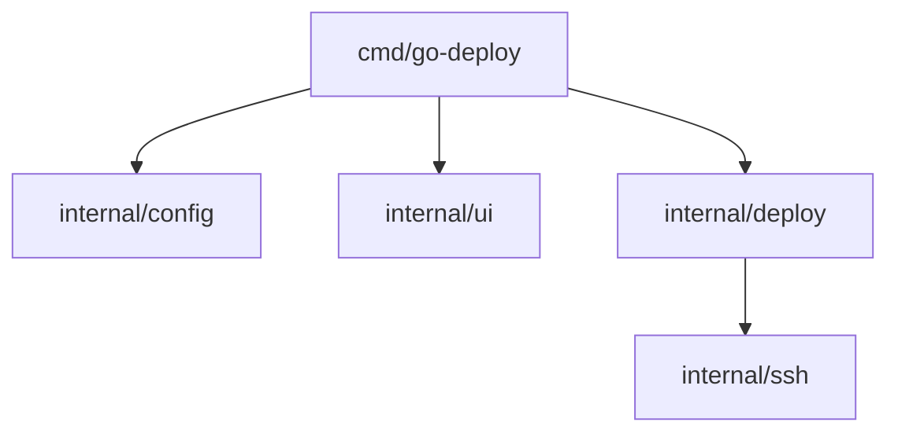

# go-deploy

[](https://github.com/richmanstudio/go-deploy/actions/workflows/ci.yml)
[](https://go.dev/)
[](./LICENSE)

`go-deploy` is a production-oriented Go CLI utility for automated SSH deployments.
It reads a YAML config, executes deploy steps sequentially, and triggers rollback on failure.

## Features

- YAML config (`deploy.yaml`) for servers and deploy pipeline
- SSH authentication via key or password
- Sequential deploy with per-step timeout support
- Automatic rollback when deploy step fails
- Terminal UX with colors, spinners, progress, and server table output
- Dry-run mode to preview commands without executing them

## Demo Output

> Add your real GIF or screenshot at `docs/demo.gif`.


## Installation

### 1) Go install

```bash
go install github.com/richmanstudio/go-deploy/cmd/go-deploy@latest
```

### 2) GoReleaser binaries

Use release artifacts from GitHub Releases (generated by `.goreleaser.yaml`).

### 3) Docker

```bash
docker build -t go-deploy:latest .
docker run --rm -v "$(pwd)":/app go-deploy:latest version
```

## Quick Start

1. Create example config:

```bash
go-deploy init
```

2. Validate config:

```bash
go-deploy validate
```

3. Show servers:

```bash
go-deploy servers
```

4. Dry-run deployment:

```bash
go-deploy deploy --dry-run
```

5. Deploy to one server:

```bash
go-deploy deploy --server staging
```

## Configuration Example

```yaml
project: my-app
version: "1.0.0"

servers:
  production:
    host: "192.168.1.100"
    port: 22
    user: "deploy"
    key: "~/.ssh/id_rsa"
  staging:
    host: "192.168.1.101"
    port: 22
    user: "deploy"
    key: "~/.ssh/id_rsa"

deploy:
  steps:
    - name: "Pull latest code"
      command: "cd /app && git pull origin main"
    - name: "Build"
      command: "cd /app && go build -o bin/app ./cmd/app"
  rollback:
    steps:
      - name: "Rollback to previous"
        command: "cd /app && git checkout HEAD~1"
```

## CLI Commands

```bash
go-deploy deploy [server]
go-deploy deploy --server staging
go-deploy validate
go-deploy servers
go-deploy init
go-deploy version
```

## Global Flags

- `--config, -c` path to config file (default: `./deploy.yaml`)
- `--dry-run` show planned actions without remote execution
- `--verbose, -v` print all command stdout/stderr
- `--no-color` disable colors for CI logs
- `--timeout` global command timeout (default: `30s`)

## Project Architecture



## Development

```bash
go test ./...
go build ./cmd/go-deploy
```

## CI/CD

- GitHub Actions workflow: lint + test + cross-platform build matrix
- GoReleaser config for release archives and checksums
- Docker multi-stage build for minimal runtime image

## License

MIT, see [LICENSE](./LICENSE).
